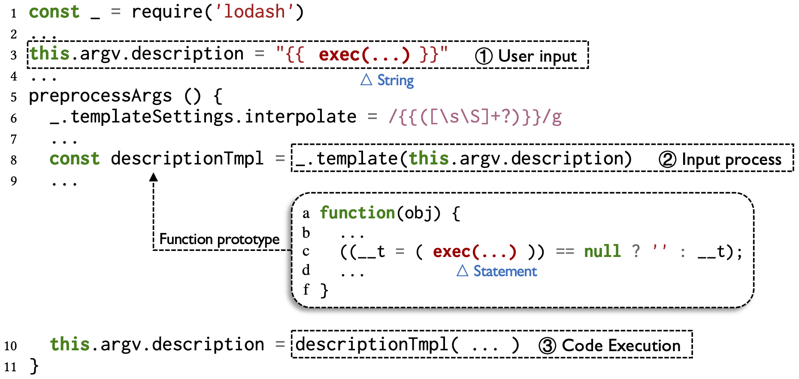
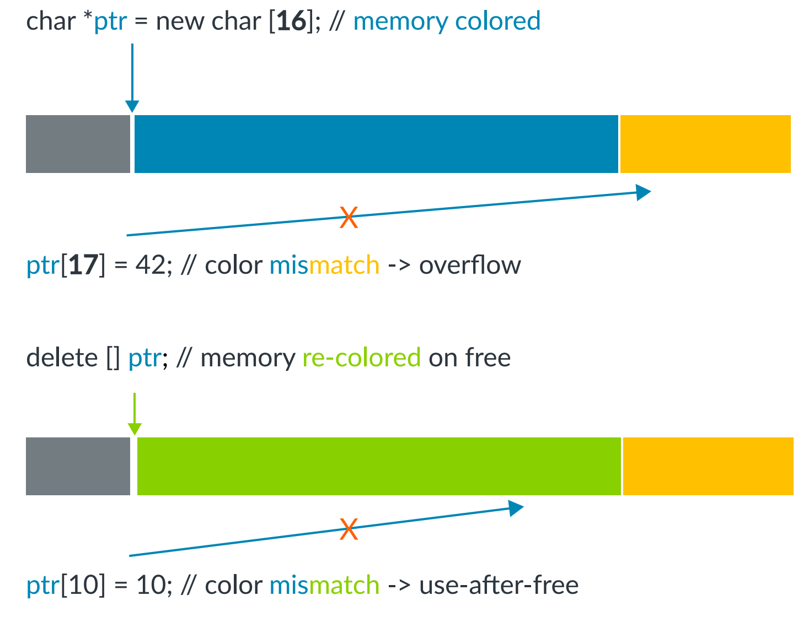

# Final Project 列表与要求

## 1. 软件供应链安全相关Project

### 1.1 面向垂直领域的供应链分析
背景：当前复杂软件系统多均依赖第三方组件构建其功能，形成软件供应链。而这些第三方组件会存在漏洞，引入一系列的安全问题。针对垂直领域的软件系统进行软件成分分析是当前的一个研究热点。

描述：从鸿蒙系统，云原生系统，AI系统，Web系统等垂直领域类中选一个类系统进行软件成分分析。

里程碑：综述、系统爬取、工具实现、系统分析；  
中期（第五周）完成：综述、系统爬取
期末（第八/九周）完成：工具实现、系统分析；

参考文档： 

1. An Exploratory Study of Deep Learning Supply Chain

### 1.2 编程语言分析工具
背景：当前复杂软件系统多均依赖第三方组件构建其功能，形成软件供应链。而这些第三方组件会存在漏洞，引入一系列的安全问题。针对垂直领域的软件系统进行软件成分分析是当前的一个研究热点。

描述：从鸿蒙系统，云原生系统，AI系统，Web系统等垂直领域类中选一个类系统进行软件成分分析。

里程碑：综述、系统爬取、工具实现、系统分析；  
中期（第五周）完成：综述、系统爬取
期末（第八/九周）完成：工具实现、系统分析；

参考文档： 

1. An Exploratory Study of Deep Learning Supply Chain


[Small World with High Risks: A Study of Security Threats in the npm Ecosystem](https://www.usenix.org/conference/usenixsecurity19/presentation/zimmerman)
2. [Demystifying the Vulnerability Propagation and Its Evolution via Dependency Trees in the NPM Ecosystem
](https://arxiv.org/abs/2201.03981)
3. [Do the Dependency Conflicts in My Project Matter? Ying](http://castle.cse.ust.hk/castle/publication/materials/fse18-ying.pdf)


### 1.2 代码相似性检测
背景： 在 Open-source software（OSS）领域中， 为了提高开发的效率，code reuse 是常见的手段。但是这种行为往往一系列问题（e.g. 由于 code reuse 造成 CVE 的跨项目传播)。因此需要辨别功能相近的两个项目之中是否存在 code reuse。

描述： 选定自己感兴趣的一种语言，爬取一定数量的开源项目，对于功能相近的项目进行代码相似性检测。

里程碑：

1. 爬取选定语言生态组件源代码，最新版本不少于500K个;
2. 爬取选定语言 Github 上的热门且有意义的项目（不少于100K个）;
3. 调研一种相似性检测算法对 1、2 中收集到的项目在File粒度和Function粒度上建立索引库，并进行相似性检测;


参考文档：

1. [CENTRIS: A Precise and Scalable Approach for Identifying Modified Open-Source Software Reuse](https://squizz617.github.io/pubs/centris-icse21.pdf)
2. [SourcererCC: Scaling Code Clone Detection to Big Code](https://arxiv.org/pdf/1512.06448.pdf)

### 1.3 跨语言调用分析（Rust/C）  

背景：Rust通常用于比较底层的项目，与C的语言规范相近，因此开发者为避免重写代码会重用C代码，因此会使用跨语言调用机制。如果C语言部分存在问题，或者跨语言接口抽象存在问题，都是难以修复或者滞后修复的。

描述：因此我们需要分析Rust生态中的library以及面向用户的Rust应用使用跨语言调用的情况，找出其中可能存在的问题。包括但是不限于：如何使用跨语言调用，调用过程可能造成的bug传递问题，是否依赖动态库或者运行平台，这些跨语言调用能通过生态依赖传递多远。

里程碑：

1. 调研Rust生态中的library以及面向用户的Rust应用使用跨语言调用的情况
2. 分析并验证存在的跨语言问题
3. 分析问题影响的范围

参考文档：

- Rust官方跨语言接口生成器`bingen`：[rust-lang/rust-bindgen: Automatically generates Rust FFI bindings to C (and some C++) libraries. (github.com)](https://github.com/rust-lang/rust-bindgen)
- 其用户指导书：[Introduction - The `bindgen` User Guide (rust-lang.github.io)](https://rust-lang.github.io/rust-bindgen/)
- 其代码开发指导书：[bindgen - Rust (docs.rs)](https://docs.rs/bindgen/latest/bindgen/)
- 一个极为常用的原生跨语言系统函数接口库`libc`：[rust-lang/libc: Raw bindings to platform APIs for Rust (github.com)](https://github.com/rust-lang/libc)

### 1.4 类Log4j2漏洞扫描

背景：Apache Log4j2 漏洞影响力巨大，其支持多种属性查找以及替换选项，其中支持的 JNDI 就是本次漏洞的触发点，攻击者可以通过使用 `jndi:` 关键字来触发 JNDI 注入漏洞，并通过RMI 或者 LDAP 的方式请求远程恶意类，导致 RCE。在漏洞被披露后， Log4j2 官方发布了修复版本2.15.0，并最终在2.16.0版本修复此漏洞。
 JNDI 注入，简单的说，就是 JNDI 接口在初始化时会将 URI 传入 InitialContext.lookup() 方法，如果这个参数 URI 可控，则可能会造成攻击，即引发 JNDI 注入。

描述：我们希望能够收集较为 popular 的 java 应用开源项目，并编写自动化分析工具，对这些开源项目进行 Log4j2 漏洞扫描检测，分析其是否受到了 Log4j2 漏洞的影响，以及是否已经完成对 Log4j2 版本的升级。我们还希望可以自动化验证引入了受到该漏洞影响的 Log4j2 版本的 java 项目是否会真正触发该漏洞。

里程碑：

1. 从 github/gitee 等开源网站开源网站上收集较为 popular 的开源的 java 项目，包含历史版本。  
2. 编写自动化分析工具，跟踪用户输入数据是否流向Log4j2漏洞方法，进行准确的漏洞reachablility解析。
3. 设计方法自动化验证Log4j2漏洞的动态可触发性。


参考文档：

1. [CVE-2021-44228 by NVD](https://nvd.nist.gov/vuln/detail/CVE-2021-44228)
2. [Log4j – Apache Log4j Security Vulnerabilities](https://logging.apache.org/log4j/2.x/security.html)
3. [Soot | Soot - A framework for analyzing and transforming Java and Android applications (soot-oss.github.io)](http://soot-oss.github.io/soot/)
4. [Home · soot-oss/soot Wiki (github.com)](https://github.com/soot-oss/soot/wiki)
5. [JNDI 注入漏洞的前世今生](https://evilpan.com/2021/12/13/jndi-injection/)

### 1.5 GitHub CI/CD 脚本漏洞分析工具

描述：[GitHub CI/CD](https://github.com/features/actions) 是 GitHub 推出的一种持续集成服务。其最大的特点是用户可以引入他人编写好的 CI scripts (GitHub 也称之为 Actions) 来搭建自己的持续集成流水线。然而，这在提高了 CI Scripts 可重用性的同时，也带来了新的安全问题。

攻击者可以利用持续集成脚本（CI scripts）中的漏洞或者将恶意代码隐藏在脚本持续集成脚本中进行攻击。目前已经发现了几个关于 CI Script 的 CVE。其中，[CVE-2020-14188](https://nvd.nist.gov/vuln/detail/CVE-2020-14188) 的利用方式简单，只需要攻击者简单的发布一个 issue 就能够触发，可以直接造成远程代码执行，漏洞危害大，因此在 CVSS 评分中达到了 9.8 (Critical) 的评分。

CVE-2020-14188 的 Root Cause 如下图所示：



- 该 CI Script 在第 6 行错误地配置了一个模板解析，该模板解析会尝试提取用户输入中 `{{` 和 `}}` 之间的内容。
- 在第 3 行中攻击者提供了恶意的输入，在 `{{` 和 `}}` 之间包含攻击者输入的恶意代码
- 经过第 8 行的模板解析，CI Script 错误地将攻击者的输入中的恶意代码提取出来，嵌入到了一个函数变量 `descriptionTmpl` 中
  - 注意第 c 行中，攻击者的输入经过模板解析，从字符串类型变成了 Statement
- 在第 10 行中，CI Script 尝试调用该函数变量，执行了攻击者的恶意输入

在该 Project 中，需要你用类似于 CVE-2020-14188 的模式，匹配其他未经检查的 CI Scripts，进行一次漏洞分析的尝试。

**里程碑**：

1. 根据参考文档，尝试自己配置 GitHub Actions 作为自己的 CI 服务，并理解 CVE-2020-14188
2. 根据 [seed](https://gitee.com/zjusec/syssec22/blob/master/src/proj/1.7/seed.txt) 文件克隆 CI scripts
    - 在这一步中你可能会因网络或存储空间等限制无法完全 clone 下来，因此只需要根据你的设备选择合适的 clone 数量即可
    - 换言之不需要 100% 完全 clone 这些 CI scripts
3. 编写简单的模式匹配工具，对每个 CI script 匹配 CVE-2020-14188 的特征。以下是一些可以参考的匹配方式：
    - `package.json` 中含有 `lodash` 的依赖
    - `*.js` 文件中引入了 `lodash` 库，参考代码中的第 1 行
    - 设置了 `lodash` 库的 `interpolate` 属性，参考第 6 行等号左侧
    - `interpolate` 属性设置为包含 `{{` 和 `}}` 的正则匹配字符串，参考第 6 行等号右侧
    - ...
4. 对匹配的结果进行分析和总结。
    - 如果你找到了可能的漏洞，可以尝试手工分析该结果是否为真正的漏洞（查看上下文的代码或尝试运行该 CI script）
    - 如果匹配的结果无一所获也无需担心。漏洞挖掘本身就需要长时间的付出和一定的运气。


**参考文档**：

1. [GitHub Actions 快速入门 by GitHub](https://docs.github.com/cn/actions/quickstart)
2. [如何理解持续集成、持续交付、持续部署？ by 知乎](https://www.zhihu.com/question/23444990)
3. [持续集成是什么？ by 阮一峰](https://www.ruanyifeng.com/blog/2015/09/continuous-integration.html)
4. [GitHub Actions 入门教程 by 阮一峰](https://www.ruanyifeng.com/blog/2019/09/getting-started-with-github-actions.html)
5. [CVE-2020-14188 by NVD](https://nvd.nist.gov/vuln/detail/CVE-2020-14188)
6. [:star2: CVE-2020-14188 Details by GitHub Security Lab](https://securitylab.github.com/advisories/GHSL-2020-172-gajira-create-action)


### 1.6 Rust不稳定版本编译器特性分析

背景：Rustc是Rust的编译器，有三种版本，分别是Stable, Beta, Nightly。按照软件工程的习惯，项目开发者应该要确保项目使用稳定版本编译器（stable）能够成功编译功能正常的软件，但是由于Rust刚诞生不久，开发者通常会倾向于使用不稳定版本（Nightly），这在许多在Cargo（Rust包管理器）上发布的包都相当常见。Nightly编译器会提供一些编译器层面的feature，以开启特殊功能，这些功能不仅不稳定，而且很有可能之后被废弃，不被支持。同时开发者依赖了这么做的library，会强制本项目使用Nightly编译器，具有传染性。这些给Rust生态带来了潜在的危险，我们需要定量分析以确定影响范围。

描述：本项目背景清晰，过程清晰，工具和数据清晰，难度适中，有实际意义，推荐选择。我们需要设计自动化脚本，从Cargo生态的library源码中，提取使用的Nightly Feature，与最新的官方Feature库比较，分类出废弃、过时以及在使用的Feature。最后根据传播生态依赖（dependency），判定其影响的范围。

里程碑：
1. 爬虫：爬取Cargo生态所有library的源码。
2. 分析脚本（核心）：提取源码中启用的Nightly Feature。
3. Feature判定：爬取官方Rust Nightly Feature，并测试是否废弃、过时以及正常使用。
4. 分析传播：Nightly Feature影响到多少library


参考文档：

- Unstable Feature大全：[alloc_layout_extra - The Rust Unstable Book (rust-lang.org)](https://doc.rust-lang.org/unstable-book/library-features/alloc-layout-extra.html)
- Cargo生态数据库：[crates.io: Rust Package Registry](https://crates.io/)
- 下载Cargo生态源码的接口（下载后用gzip解压）：
  - API: https://crates.io/api/v1/crates/$(crate)/$(version)
  - Compressed package(gzip): https://crates.io/api/v1/crates/$(crate)/$(version)/download
- 一个只能用Nightly编译的例子：[riscv 0.7.0 - crates.io: Rust Package Registry](https://crates.io/crates/riscv/0.7.0)
  - 需要开启`inline-asm` feature然后编译，会发现编译器feature已经被废弃，无法编译。


## 2. 操作系统安全相关Project

### 2.1 基于MTE的内存完整性保护

背景：内存损坏漏洞仍然是最常见且后果最严重的漏洞之一，它既包括栈溢出、堆溢出等空间维度上的漏洞，也包括重复释放（Double-free）和释放后使用（Use-after-free）等时间维度上的漏洞。硬件厂商提出了不同种类的硬件支持来高效地缓解内存损坏漏洞，而Memory Tagging Extension（MTE）就是其中之一。

Arm在2019年发布的ARMv8.5硬件规范中首次提出了MTE，它用4个比特位对每16字节的内存进行着色，而指针的高位同样有4个比特位标记指针的颜色。如此，只有当指针颜色和内存颜色一致时访存操作才是合法的。



如上图所示，MTE同时能防护时空两个维度上的内存损坏漏洞，因此近年来受到工业界和学术界的广泛关注。然而，目前还缺乏可行的基于MTE的对内核内存进行实时保护的方法，由于内核安全的重要性和MTE硬件提供的高性能安全能力，如何将二者有机结合已经成为近年来研究的关注焦点。


描述：本项目旨在使同学们入门硬件辅助安全（Hardware-assisted security）这一热门领域，同时深入了解MTE这一新兴的硬件安全特性。由于大部分MTE相关的详尽资料都是英语写作，因此本项目需要一定的英文文献阅读能力。本项目难度较高，请同学们谨慎选择。


里程碑：  

1. 阅读参考文档并收集更多的相关资料和文献，总结MTE的优缺点，以及最新的研究工作使用MTE的方法。
2. 成功编译支持MTE的Linux内核并在QEMU上运行。
3. 用MTE保护一个有溢出漏洞或者double-free漏洞的用户态程序，用调试器跟踪观察有/无保护的程序在攻击者利用时不同的程序行为。
4. 设计并实现一种用MTE来保护Linux内核内存的方法。


参考文档：  

1. [ARM MTE白皮书](https://developer.arm.com/-/media/Arm%20Developer%20Community/PDF/Arm_Memory_Tagging_Extension_Whitepaper.pdf)
2. [内存问题的终极武器——MTE](https://juejin.cn/post/7013595058125406238)
3. [Memory Tagging and how it improves C/C++ memory safety](https://arxiv.org/pdf/1802.09517.pdf)
4. [Memory Tagging Extension (MTE) in AArch64 Linux](https://www.kernel.org/doc/html/latest/arm64/memory-tagging-extension.html)
5. [Color My World: Deterministic Tagging for Memory Safety](https://arxiv.org/pdf/2204.03781.pdf)
6. [Preventing Kernel Hacks with HAKC](http://hexhive.epfl.ch/publications/files/22NDSS2.pdf)

### 2.2 OS内核DMA攻击的分析与防护-Apple M1芯片UMA分析

描述：在M1芯片上，CPU和GPU各有自己的页表，因此它们都可以直接访问内存。然而这可能会存在安全性问题，比如操作系统内核数据与GPU可以访问的数据映射在同一页面。在这种映射配置下，假如[攻击者攻击GPU驱动，获得对GPU的控制，那么就可以进一步攻击内核](https://googleprojectzero.blogspot.com/2020/09/attacking-qualcomm-adreno-gpu.html)。因此我们想分析在M1上的macOS是如何设置GPU的页表，其设置是否会引入上述安全性问题。

里程碑：  

1. 根据参考文献，理解IOMMU相关的攻击，分析M1 IOMMU（DART）与SMMU的区别
2. 结合XNU开源代码，逆向和动态分析（m1n1 hypervisor），分析XNU内核如何设置GPU的页表。
3. dump出GPU的页表和XNU内核页表，分析是否存在sub-page attack的问题
4. 结合其他苹果定制的硬件进一步分析攻击的可行性
5. 利用m1n1 hyprvisor模拟攻击

**参考文档**：

1. [Characterizing, exploiting, and detecting DMA code injection vulnerabilities in the presence of an IOMMU](https://dl.acm.org/doi/10.1145/3447786.3456249)
2. [True IOMMU Protection from DMA Attacks: When Copy is Faster than Zero Copy](https://dl.acm.org/doi/10.1145/2980024.2872379)
3. [DART PTE格式](https://elixir.bootlin.com/linux/latest/source/drivers/iommu/apple-dart.c)
4. [Over The Air: Exploiting Broadcom’s Wi-Fi Stack (Part 2)](https://googleprojectzero.blogspot.com/2017/04/over-air-exploiting-broadcoms-wi-fi_11.html)
5. [Attacking the Qualcomm Adreno GPU](https://googleprojectzero.blogspot.com/2020/09/attacking-qualcomm-adreno-gpu.html)
6. [XNU开源代码](https://github.com/apple-oss-distributions/xnu/tree/xnu-8019.80.24)
7. [Apple SPRR and GXF](https://blog.svenpeter.dev/posts/m1_sprr_gxf/)
8. [Apple KTRR and Rorgn](https://blog.siguza.net/KTRR/)

### 2.3 基于eBPF的内核状态监控与防护 

背景：Extended Berkeley Packet Filter(eBPF)是一个Linux子系统，它允许在不修改内核的前提下，在内核中动态加载并安全地执行不受信任的用户自定义扩展。尽管允许用户在内核中执行任意代码一直被认为是不明智的，但BPF通过一系列的机制(verifier)确保了安全性。如今eBPF在系统跟踪、观测、性能调优、网络和安全等领域发挥重要的角色，孵化了很多知名项目，如cilium，sysdig falco等，有人甚至提出eBPF可能会促进微内核化的进程，并称其为超能力。eBPF提供的针对内核与用户进程的高可观测性对复杂环境(如云原生环境)的性能、安全等的监视与防护具有重要意义，而其在安全领域的潜在恶意利用，也引起了广泛的关注。

描述：本项目通过层层递进的方式逐渐深入BPF的内核观测与保护，涵盖了eBPF的各个方面，包括：观测，防护，自定义内核处理逻辑，配套工具使用和前沿探索性质的研究，工作量合理，难度适中，要求一定量的文献阅读和检索，与研究前沿接轨，目标设计有实际意义，旨在熟悉和掌握有前景的新技术和思想，并在此过程中加深对操作系统内核的理解

里程碑：

1. 理解内核中BPF的作用原理，使用BPF C编程实现基于规则的反弹shell检测(如拒绝不在白名单内的ip地址发起的远程shell连接)。
2. 借助BCC实现内核线程pid耗尽攻击检测与防护。
    - 内核线程pid耗尽：同一时期内核中存在的进程数量是有限的，pid数目达到上限后就无法开启新进程；因此需对非特权用户可开启的进程数进行限制，尽管内核中已有机制限制非特权用户的pid耗尽攻击，但攻击者仍可通过巧妙的方式绕过施加的限制
    - 防护效果:防护开启后恶意user_ns内的用户无法耗尽系统pid，如可以使当恶意的用户进程fork出超出配置规则数量的进程，kill这些恶意进程，并在kernel space使用BPF的机制阻止产生新的恶意进程，同时输出日志。
    - Tips：借助BCC工具可更方便地使用BPF，从而专注于需求实现本身；比起1中的基于行为的检测这里的防护工作需要描述内核运行过程中的状态；可结合用户态探针，如uprobe；对防护的完善性不作要求
3. BPF恶意利用攻防:利用BPF实现rootkit，对cron无感知地(如8中的效果)插入后门，可以执行任意命令或向攻击方发起反向连接，并设计利用BPF的，对BPF恶意利用的检测系统框架(基于规则的面向BPF syscall的检测，如非预期用户挂载了敏感类型探针)
    - 借助perf，systemtap等工具生成火焰图观察1-3中引入BPF探针的开销(内核态和用户态)，思考如何减小开销，是否可用BPF提升内核运行效率
    - 思考1-3的BPF程序是否完善(对完善性及其证明不做要求)

**参考文档**：

1. Calavera D, Fontana L. Linux Observability with BPF: Advanced Programming for Performance Analysis and Networking[M]. O'Reilly Media, 2019.
2. Gregg B. BPF Performance Tools[M]. Addison-Wesley Professional, 2019.
3. Vieira M A M, Castanho M S, Pacífico R D G, et al. Fast packet processing with ebpf and xdp: Concepts, code, challenges, and applications[J]. ACM Computing Surveys (CSUR), 2020, 53(1): 1-36.
4. [Brendan Gregg's Homepage](https://www.brendangregg.com/index.html)
5. [BPF Compiler Collection (BCC)](https://github.com/iovisor/bcc)
6. [Flame Graphs visualize profiled code](https://github.com/brendangregg/FlameGraph)
7. [云原生安全攻防｜使用eBPF逃逸容器技术分析与实践](https://security.tencent.com/index.php/blog/msg/206)
8. [内核态eBPF程序实现容器逃逸与隐藏账号rootkit](https://www.cnxct.com/container-escape-in-linux-kernel-space-by-ebpf/)
9. [Warping Reality - creating and countering the next generation of Linux rootkits using eBPF](https://defcon.org/html/defcon-29/dc-29-speakers.html#path)
10. [With Friends Like eBPF, Who Needs Enemies?](https://www.blackhat.com/us-21/briefings/schedule/#with-friends-like-ebpf-who-needs-enemies-23619)
### 2.4 针对内核的非控制数据攻击

背景：操作系统内核作为计算机系统的基础，针对内核的攻击和防护已有较长的是研究历史，当前主流的攻击技术仍然是通过篡改内核控制数据（函数函数之和代码指针），进而劫持程序控制流。与此同时，针对控制数据的保护也越来越成熟，比如Linux内核已经支持匹配函数类型的CFI，ARM提出PAC用于保护控制数据。这些保护方案的广泛应用使得攻击者篡改控制数据的难度大大提高。
篡改非控制数据达的攻击逐步引起重视，但目前大部分工作集中于研究用户态程序的非控制数据，对于内核的研究很少。因此本项目需要你用静态分析技术获得容易遭受攻击的非控制数据，并编写POC篡改数据，论证非控制数据的攻击效果。

描述：我们发现篡改内核特定的非控制数据能达到各种攻击，比如每个进程（task_struct）包含一个cred，cred里面包含用户id（结构体`kuid_t`）、用户权限信息(结构体`kernel_cap_t`)等，如果篡改了该进程的用户id或者权限信息可以获得root权限，造成提权攻击。
本项目需要你设计静态分析pass，自动分析一种特定的非控制数据 —— 包含`kuid_t`的结构体，比如`cred`、`kern_ipc_perm`等，然后分析结构体实例化的变量是堆、栈（暂时不考虑全集变量），给出篡改用户id需要的攻击原语。选用特定数据，先采用gdb调试，证明修改变量能够到到攻击效果。最后利用内核在野的漏洞或重写现有POC实现攻击。


里程碑：

1. 安装 Clang/LLVM（v14.0.0），下载内核源码（v5.15），利用 Clang/LLVM 编译内核源码，生成可以用于静态分析的中间表示文件。
2. 编写简单的静态分析工具：
   - 记录直接或者间接包含 `kuid_t` 的结构体类型，即至少有一个域类型为 `kuid_t`。
     - 比如结构体类型 `kern_ipc_perm` 直接包含了 `kuid_t`，而 `shmid_kernel` 又直接包含了 `kern_ipc_perm`，因此 `shmid_kernel` 间接包含`kuid_t` ，记录下直接和间接包含的两个结构体。这里的包含关系不考虑指针，比如 `task_struct` 里面是的域是 `cred *`，是指针类型，因此不记录 `task_struct`。
     - **提示**：扫描中间表示中所有的结构体类型，接口为`module.getIdentifiedStructTypes()`，递归地获取每个element的类型，判断其类型是否为 `kuid_t`。
     - **提示**：编译器会合并相同布局的结构体，比如 `kuid_t` 和 `atomic_t` 结构体布局一致，则中间表示只保留其中的一个，假设保留了`kuid_t`，所有使用`atomic_t`的位置也将变为使用`kuid_t`。为了避免合并优化，注释掉编译器优化代码，在llvm/lib/Linker/IRMover.cpp中。
    
   - 追踪记录的结构体类型实例化的变量，所属的位置，报告堆、栈（先不考虑全局变量）。针对每个结构体，报告所有该类型的变量的总数（堆和栈数量总和即可），分别出于堆、栈上的数量，并给出变量所在源代码的位置。
     - 无需跨函数分析，在一个函数内分析不出则放弃。提示，扫描所有函数内的指令，如果是堆上的变量一般采用内核特定alloc接口。
     - **提示**：栈上的变量通常会用Clang/LLVM的提供的函数alloca分配，比如`%5 = alloca %struct.iovec, align 8`，%5 是函数内的局部变量，扫描使用alloca分配的结构体，并统计频数和出现的源代码位置。
     - **提示**：首先扫描所有的内核函数，如果函数名包含字串 `alloc` 则记录该函数为内核分配堆上的结构体函数。然后再次扫描所有内核函数，获取每个函数包含的call指令，如果指令调用了分配函数，并且分配的类型为直接或间接包含`kuid_t` 的结构体类型，则记录为堆上的变量，并统计频数和源代码位置。
3. 选用1个非控制数据，利用gdb调试，分析篡改数据后的攻击效果。
4. 利用内核在野的漏洞或重写现有POC实现篡改非控制数据的攻击。
5. 加分项：发现并成功攻击多个非控制数据（实现3、4步）加分，除去已知的数据类型（kuid_t->val, cred->cap_xxx, inode->i_mode, vfs_mount->mnt_flags)

```c
struct kern_ipc_perm {
	spinlock_t	lock;
	bool		deleted;
	int		id;
	key_t		key;
	kuid_t		uid;
	kgid_t		gid;
	kuid_t		cuid;
	kgid_t		cgid;
	umode_t		mode;
	unsigned long	seq;
	void		*security;

	struct rhash_head khtnode;

	struct rcu_head rcu;
	refcount_t refcount;
} ____cacheline_aligned_in_smp __randomize_layout;

```


**参考文档**：

1. Song, Chengyu, et al. "Enforcing Kernel Security Invariants with Data Flow Integrity." NDSS. 2016.
2. [编译内核的中间表示文件](https://blog.xiexun.tech/compile-linux-llvm.html)
3. [Build Clang/LLVM](https://llvm.org/docs/GettingStarted.html)
4. [Write LLVM pass](https://llvm.org/docs/WritingAnLLVMPass.html)
5. [LLVM pass 接口](https://llvm.org/doxygen/classllvm_1_1Value.html)

## 3. Presentation安排

To Be Decided
